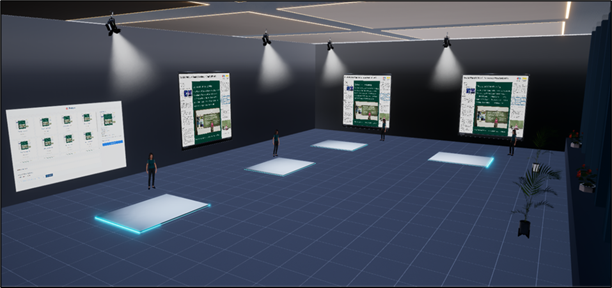
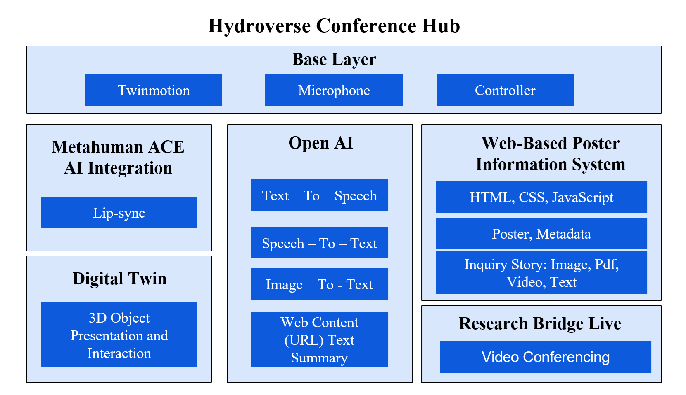
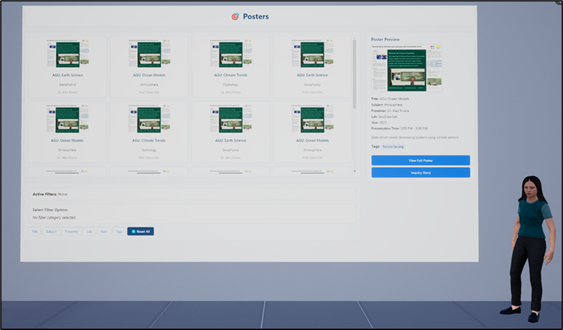
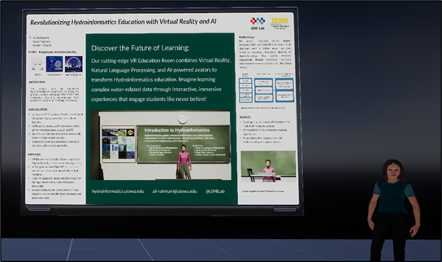
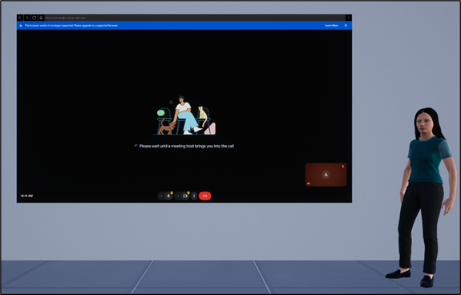

<p align="center">
  
</p>

# HydroVerse Immersive Virtual Conference Environment


**HydroVerse Immersive Virtual Conference Environment** is a novel system that reimagines scientific conferences through the seamless integration of Extended Reality (XR) and generative Artificial Intelligence (AI). Developed at the University of Iowa, this platform allows users to navigate a 3D presentation hall, explore academic posters, and engage in real-time, voice-driven interactions with realistic Metahuman avatars.

The system addresses the limitations of traditional and virtual conferences by offering a dynamic, accessible alternative that emphasizes personalization, engagement, and embodied understanding.

---

## Table of Contents
- [Key Features](#key-features)
- [System Architecture](#system-architecture)
- [Installation & Requirements](#installation--requirements)
- [Modules & Usage](#modules--usage)
- [Data Availability](#data-availability)
- [Funding & Acknowledgements](#funding--acknowledgements)
- [Citation](#citation)

---

## Key Features

* [cite_start]**Immersive 3D Environment:** A fully navigable conference hall built in **Unreal Engine 5** using Lumen and Nanite for high-fidelity rendering[cite: 54].
* [cite_start]**Interactive Metahuman AI:** Users interact with AI-driven avatars that deliver voice-over summaries and answer questions in real-time using **OpenAI** and **NVIDIA ACE**[cite: 55].
* [cite_start]**Voice-Driven Q&A:** Supports natural language voice interaction, converting user speech to text and synthesizing AI responses with synchronized lip movements[cite: 147].
* [cite_start]**Digital Twin Exploration:** Users can manipulate high-fidelity 3D models of research artifacts (e.g., sensors) to understand form-function relationships[cite: 185].
* [cite_start]**Research Bridge Live:** Seamless integration of video conferencing allows users to transition from AI interaction to live video calls with researchers[cite: 206].
* [cite_start]**Web-Based Discovery:** A decoupled web interface for efficient poster filtering, search, and content management[cite: 192].

---

## System Architecture

[cite_start]The architecture consists of four interconnected modules: the Virtual Environment (Unreal Engine), the OpenAI Generative AI Pipeline, the Metahuman AI Integration (ACE), and the Web-Based Poster Information System[cite: 159].

<p align="center">
  
  <br>
  <em>Figure: System Architecture of AI Powered Virtual 3D Conference.</em>
</p>

### Core Components
* **Base Layer:** Utilizing **Meta Quest 3** hardware for VR input (microphone, controller) and Twinmotion for environmental assets.
* **AI Integration:** **OpenAI** handles summarization and Q&A, while **NVIDIA ACE** handles audio-to-face animation.
* **Data Layer:** A local Python server hosts the web-based poster system (HTML/CSS/JS) containing metadata, images, and full-text research documents.

---

## Installation & Requirements

### Hardware Requirements
* **VR Headset:** Meta Quest 3 (Recommended) via Link/AirLink.
* [cite_start]**PC Specifications:** High-performance PC (e.g., Intel Core i9, NVIDIA RTX 4080) recommended for real-time rendering[cite: 391].

### Software Prerequisites
* [Unreal Engine 5.3](https://www.unrealengine.com/)
* Python 3.x

### Setup Instructions

1.  **Clone the Repository:**
    ```bash
    git clone [https://github.com/uihilab/HydroVerse-Conference.git](https://github.com/uihilab/HydroVerse-Conference.git)
    ```

2.  **Install Required Plugins:**
    Copy the following plugins into the `Plugins` folder within the project directory:
    * **NV_ACE_Reference** (NVIDIA Audio2Face integration)
    * **OpenAI** (OpenAI API integration)

3.  **Configure Authentication:**
    Locate the configuration files in the root directory and update them with your API keys:
    
    * `OpenAIAuth.ini`:
        ```ini
        APIKey=YOUR_OPENAI_API_KEY
        OrganizationID=YOUR_ORG_ID
        ProjectID=YOUR_PROJECT_ID
        ```
    * `OnlineServicesAuth.ini`:
        ```ini
        WeatherstackAccessKey=YOUR_KEY
        NewsApiOrgApiKey=YOUR_KEY
        ```

4.  **Launch the User Interface Server:**
    Before running the VR application, you must start the local web server for the poster interface. Open a terminal in the `UI_Conference` directory and run:
    ```bash
    python -m http.server 8000
    ```

5.  **Run the Project:**
    * Open `HydroVerseConference.uproject` in Unreal Engine 5.3.
    * Ensure the **OpenXR**, **NV_ACE_Reference**, and **OpenAI** plugins are enabled.
    * Build shaders and launch "VR Preview".

---

## Modules & Usage

### 1. Conference Hall & Poster Discovery
[cite_start]Users enter the main hall and use the **Poster Discovery Interface** to filter research by category, presenter, or subject without needing keyboard input[cite: 245].

<p align="center">
  
  <br>
  <em>Figure: Web-based interface for poster discovery and selection.</em>
</p>

### 2. AI-Driven Presentation & Q&A
Upon selecting a poster, a Metahuman avatar delivers an automated summary. Users can press the microphone button on the controller to ask questions. [cite_start]The system captures speech, queries the full-text paper via OpenAI, and the avatar responds verbally with synchronized lip-sync[cite: 326].

<p align="center">
  
  <br>
  <em>Figure: Interactive question-and-answer loop between user and Metahuman avatar.</em>
</p>

### 3. Digital Twin Exploration
For applicable research, users can view detailed 3D models (Digital Twins) of equipment (e.g., sensors). [cite_start]These objects can be rotated and inspected while the AI explains specific components[cite: 290].

<p align="center">
  
  <br>
  <em>Figure: Digital twin of an IFC water sensor displayed for interactive exploration.</em>
</p>

### 4. Research Bridge Live
[cite_start]If a deeper discussion is needed, users can join a scheduled live video call with the author directly inside the VR environment[cite: 356].

<p align="center">
  
  <br>
  <em>Figure: Video conferencing session embedded within the Hub.</em>
</p>

---

## Data Availability

* **Source Code:** Available in this repository.
* **3D Assets & Content:** Poster images, metadata, and 3D digital twins are managed via the web-based system and can be customized in the `UI_Conference` or `Content` directory.
* **License:** This project is licensed under the MIT License - see the [LICENSE.txt](LICENSE.txt) file for details.

---

## Funding & Acknowledgements

[cite_start]This project was funded by the **National Oceanic and Atmospheric Administration (NOAA)** via the Cooperative Institute for Research to Operations in Hydrology (CIROH)[cite: 476].

---

## Citation

If you use this system in your research, please cite our paper:

Rahmani, A., Sermet, Y., & Demir, I. (2025). HydroVerse Immersive Virtual Conference Environments with Metahuman AI: A New Paradigm for Interactive Scientific Research Communication and Engagement. ResearchGate. doi:10.13140/RG.2.2.24140.48003

**BibTeX:**

```bibtex
@article{rahmani2025hydroverse,
  title={HydroVerse Immersive Virtual Conference Environments with Metahuman AI: A New Paradigm for Interactive Scientific Research Communication and Engagement},
  author={Rahmani, Ali and Sermet, Yusuf and Demir, Ibrahim},
  journal={ResearchGate},
  year={2025},
  doi={10.13140/RG.2.2.24140.48003},
  url={[https://doi.org/10.13140/RG.2.2.24140.48003](https://www.researchgate.net/publication/399167569_HydroVerse_Immersive_Virtual_Conference_Environments_with_Metahuman_AI_A_New_Paradigm_for_Interactive_Scientific_Research_Communication_and_Engagement)}
}